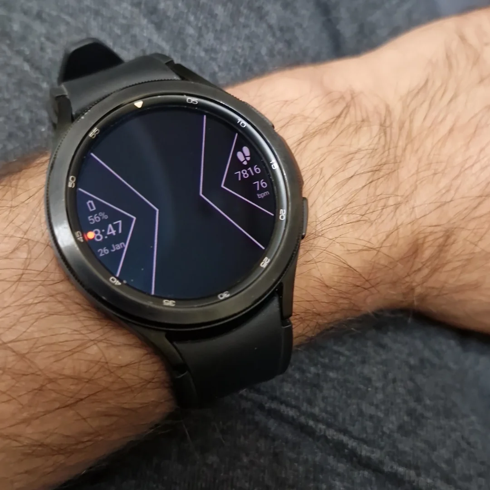

# UniversalOmnitrixWatchFace
A Universal Omnitrix Watchface for the Galaxy Watch (and other Wear OS devices)

## How to Install

### For Wear OS:

1. Download the apk and aab files onto your paired phone.
2. Install an app such as [GeminiMan WearOS Manager](https://play.google.com/store/apps/details?id=com.geminiman.wearosmanager&hl=en_IN) on your phone and the corresponding app on your watch as well.
3. Turn on Developer Options on your watch by going into Settings->System->About and tapping Build Number 7 times.
4. A dialog will appear confirming that you are now a developer.
5. Connect your Phone and Watch to the same Wi-Fi network
6. Now on your watch go to Settings->Developer Options->Wireless Debugging and turn it on. It will ask you whether you want to allow it on your current Wi-Fi network, choose Allow and continue.
7. In the GeminiMan app, click the "Wireless Debugging" option and then tap "Pair New Device" on your watch, followed by entering the IP Address, Port, and Pairing Code from your watch into the GeminiMan app, and tap Connect
8. Then tap on X on your watch, and enter the main IP Address and Port into the GeminiMan app, then tap "Connect"
9. Now, GeminiMan app will sync with your watch which might take a minute or two. After this, you can select "Install APK File" on the app, and load the APK file you downloaded.

Voila, you are done. Enjoy!

## Gallery:

### AOD (With Omniverse style selected):

### Main Watchface (With Omniverse style selected):

### Color Chooser (With Original Series style selected):

### Style Chooser (With 5YL Series style selected):

### Minute Index Disabled (With Original Series + Ben 23 style selected):

### Hour Index Disabled (With Omniverse + Mad Ben style selected):

